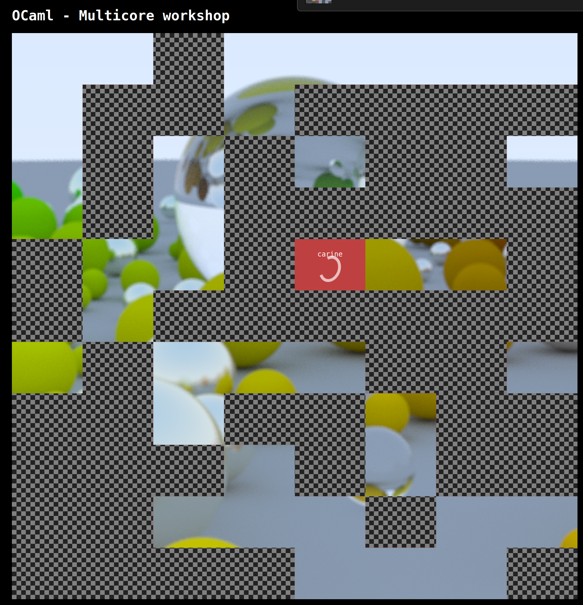

# Fun OCaml &mdash; Concurrency and Parallelism



This workshop is about parallelizing ray tracing jobs!

The current repository contains:
- A ray tracing library,
- A server managing clients (also named *actors*), by serving them parts of the
  image, and displaying the result,
- An actor library.

<span id="actors">Your</span> job is to write an "actor" or client that

1. Requests rendering jobs from the server,
2. Renders the job into an image,
3. Respond to server with the rendered image, and
4. Repeat.

and does that as quickly as possible.

By connecting to the same server, you'll be able to watch live the image being
rendered. Who completes the most rendering jobs?

We are here to help. Feel free to ask any questions!

## Install

Clone the repository and install dependencies:

```shell
$ opam pin add . --with-version=dev
```

## Local Test

You can run the server locally:

```shell
$ dune exec multicore_workshop.server
```

Visit http://localhost:8080/ with your browser.

You can then run one of the solution with the local server:

```shell
$ dune exec -- ./solutions/naive.exe $USER
```

You can also try to connect to our server with a solution, by specifying the
server ip:

```shell
$ dune exec -- ./solutions/naive.exe $USER $SERVER
```

However, of course the goal is to connect to the server with one of _your_
program!

## 1. Writing a purely sequential actor: `actors/naive.ml`

In order to familiarize yourself with the actors writing, we start by defining a
non-concurrent one.

Recall the basic loop for [actors](#actors).

To help you complete this, the `actors/naive.ml` file contains a
skeleton. Moreover, you have access to the `Actor` library, which provides
functions such as `request` and `render`.

A convenient way to see the full documented API for `Actor` is to run:

```shell
$ dune build @doc
# Use open or firefox or ... if you don't have xdg-open
$ xdg-open _build/default/_doc/_html/multicore_workshop/Actor/index.html
```

Once you have completed `actors/naive.ml`, test it against our server!

```shell
$ dune exec actors/naive.exe $USER $SERVER
```

Rendering can be done completely independently for each pixel, so we can go
faster with parallelization.

## 2. Naive parallelization: `actors/multi_requests.ml`

> [!NOTE]
> The server won't send more than three requests at the same time to the same
> client.

In the `actors/multi_requests.ml` file, modify the actor to take multiple (max
3) requests concurrently.

- First, use fibers (with the
  [`Eio.Fiber`](https://ocaml.org/p/eio/latest/doc/Eio/Fiber/index.html)
  module).

  Do you see any improvement? Why?

- Then, use domains. You can use
  [`Eio.Domain_manager`](https://ocaml.org/p/eio/latest/doc/Eio/Domain_manager/index.html),
  or directly [`Domain`](https://ocaml.org/manual/5.2/api/Domain.html) (the
  module from OCaml 5)

  Do you see any improvement? Why?

## 3. Splitting the jobs: `actors/splitting_with_domains.ml`

Since the server won't send us more than three jobs, and we have more than three
cores, we are going to split the jobs. The `Actor` library contains the right
functions to do that.

In a the `actors/splitting_with_domains.ml` file, split the jobs in as many
parts as cores you have.

> [!NOTE]
> Spawning more domains than you have cores will make the efficiency drop!

## 4. Reusing the domains `actors/splitting_with_pool.ml`

In your previous solution, you may have spawned new domains for every new job
sent by the server.

Spawning a domain is a costly operation. In the `actors/splitting_with_pool.ml`
use an execution pool to create domains once, and reuse them thereafter. You
will need to use the
[`Eio.Executor_pool`](https://ocaml.org/p/eio/latest/doc/Eio/Executor_pool/index.html)
module.

## 5. Balancing the load: `actors/load_balancing.ml`

Note a few things:
- It is not always possible to separate the task in exactly the number of cores
  you have.
- Even if we can, some tasks may take longer than others (in our case, some
  pixels take less time to compute, eg the sky!)

As a consequence, some cores may have finished before others, and are stuck
waiting on the next request to the server.

To fix this, it is possible to split the jobs in smaller parts, and let each
domain pick the next part when it has finished the previous.

One way to do that is to use an executor pool
([`Eio.Executor_pool`](https://ocaml.org/p/eio/latest/doc/Eio/Executor_pool/index.html)),
and let the pool distribute the tasks.

However, in this solution we split a task in small one and distribute them to
the domains, but we still need to finish the whole task before asking the next
one to the server. If there is one pixel that is extra long to compute, that can
be a problem.

One way to fetch the new tasks earlier is to let them pick the tasks from a
queue. If the queue is empty, they fetch a new job and feed the queue with the
new small jobs. However, since the queue is accessed in parallel, we need an
implementation that is safe in this situation.

The
[`Saturn.Queue`](https://ocaml.org/p/saturn_lockfree/0.5.0/doc/Saturn_lockfree/Queue/index.html)
module provides such an implementation!.

Try both implementations in `actors/load_balancing.ml`.

## Measurement

Try to measure the speed of each implementation!

## More speedups?

Does your program use all the cores effectively?

If not, figure out the bottlenecks and modify your program to avoid them.

## Solutions

Solutions can be found in the `solutions` folder.
